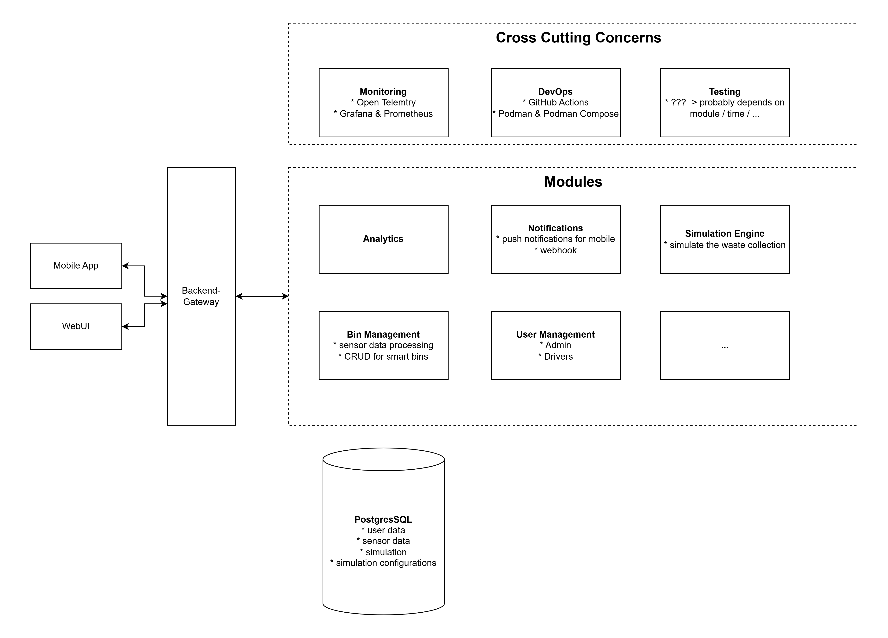

# SmartBinSim

This project is meant to be a simulation of a smart city bin management system. With this project you can simulate how the waste in (bigger) cities could be managed in a more efficient (maybe automated) way.

The project is licensed under the MIT License. For more information see the [LICENSE](./LICENSE.md) file.

## Table of Contents

1. [Motivation](#1-motivation)
2. [Structure and Development](#2-structure-and-development)
3. [Prerequisites](#3-prerequisites)
4. [What are the next steps?](#4-what-are-the-next-steps)

## 1. Motivation

In todays world the waste management is a big problem. The waste is piling up and the cities are getting bigger and bigger. The waste management is getting more expensive. Waste Management Companies try to find new ways to manage the consequences of this trend more efficiently.

One way to do this is to use smart bins. These bins are equipped with sensors and can communicate with a central server. This way the waste management company can see how full the bins are and can plan the routes of the garbage trucks based on this information.

## 2. Structure and Development

As today I don't know how complex the project is going to be, which is why I decided to use a modular monolith architecture approach. This way I can easily split the project into microservices if needed in the future.

For now, this is the architecture I have in mind. Probably there are many missing things, I will come along while developing the project.

For the sake of simplicity I decided to use a monorepo approach. This way I can easily manage the dependencies between the modules. Also this project will be developed for local use only for the first time, but should be flexible enough to host it on a virtual machine or a cloud service.

## 3. Prerequisites

- .NET >= 8.0
- Podman
- Podman Compose
- Docker (for development in dev container)
- PostgreSQL

## 4. What are the next steps?

- [ ] create dev container
- [ ] generate sensor data for the bins
- [ ] find a way how to store the sensor data in a scalable way (directly to database? in a message queue?)
- [ ] create simple API to get stored sensor data
- [ ] build simple frontend (web) with a map and show the bins on the map and create bins
- [ ] show the sensor data of the bins on the frontend (feature-flag for debugging...)
